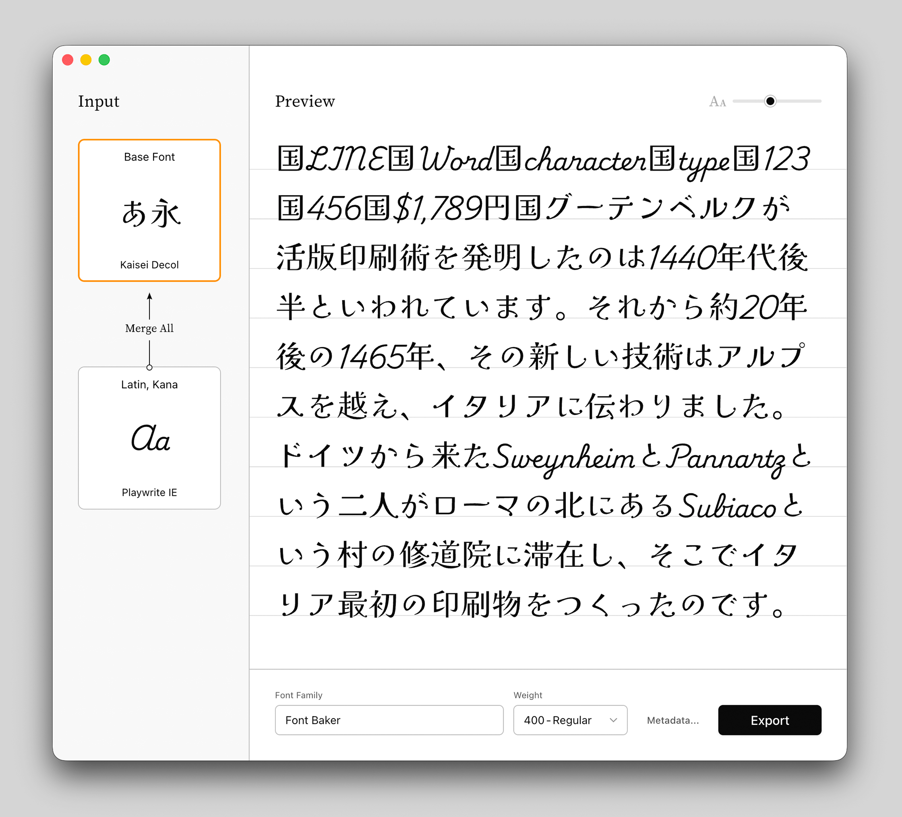

<div align="center">
  
  <h1>OFL Font Baker</h1>
  <p>English | <strong><a href="README.ja.md">日本語</a></strong></p>
</div>

## Composite Font Builder

OFL Font Baker is a macOS application for merging and exporting fonts.  
It combines two font files into one and exports the result as a static font (`.otf` / `.ttf`, `.woff2`).

In addition to mixed Latin/Japanese typesetting and kana replacement, it can also export a static instance of a variable font.



## Features

### Merging

- Per-font baseline and scale adjustment
- Variable font support (single-font export also supported)
- Real-time preview
- Kerning and OpenType feature preservation
- Automatic metadata integration

### Export Formats

Both desktop and lightweight web formats are generated in a single export.

- `.otf` / `.ttf`: Desktop use. Install on your computer to use system-wide.
  - The optimal format is selected based on the input
- `.woff2`: Web use. Upload to your server for use on websites.

## OFL Fonts Only

Only fonts licensed under the **SIL Open Font License (OFL)** can be loaded.

The OFL is an open-source license created by SIL International. It allows free use, modification, and redistribution of fonts while protecting attribution to the original authors.
Many high-quality typefaces are published under the OFL, including those on [Google Fonts](https://fonts.google.com/), [Collletttivo](https://www.collletttivo.it/typefaces), and the [Noto font family](https://github.com/googlefonts/noto-fonts).

## Download

<a href="https://github.com/yamatoiizuka/ofl-font-baker/releases/latest/download/Font-Baker-arm64.dmg">
  <picture>
    <source media="(prefers-color-scheme: dark)" srcset="docs/assets/download-for-mac-dark.svg">
    
  </picture>
</a>

<br>

Apple Silicon Macs (arm64) only. For past versions, see the [Releases](https://github.com/yamatoiizuka/ofl-font-baker/releases) page.

## Support

If you find this project useful, we would appreciate your support for continued development.

<a href="https://www.buymeacoffee.com/yamatoiizuka" target="_blank"></a>

---

## Font Licensing

OFL Font Baker only handles fonts published under the OFL ([OFL Fonts Only ⇧](#ofl-fonts-only)).  
This section summarizes the rules that apply when using and distributing such fonts.

### Distributing Merged Fonts

When distributing fonts that have been modified or merged under the OFL, the following rules apply:

1. **Retain Copyright and License** — All original copyright notices and the OFL license text must be preserved.
2. **Distribute Under the Same License** — Derivative fonts must be distributed under the OFL. You cannot change the license.
3. **No Use of Reserved Font Names** — If the original font declares a Reserved Font Name, that name cannot be used in the derivative font. For example, if the original states `with Reserved Font Name 'Noto'`, the merged font name must not contain "Noto".
4. **No Standalone Sale** — Font files cannot be sold on their own. However, bundling them with software is permitted.

OFL Font Baker automatically sets metadata (copyright notices and license information) in compliance with rules 1 and 2 above.  
Rules 3 (font naming) and 4 (distribution method) are the user's responsibility.  
When distributing, it is recommended to include an OFL.txt file containing the copyright notices and the full OFL license text.

For more details, see the [SIL Open Font License official site](https://openfontlicense.org).

### Merging Your Own Fonts

To load your own fonts in OFL Font Baker, the font must be identifiable as OFL-licensed by the software. Set the following in the font's name table:

**License (nameID 13):**

```
This Font Software is licensed under the SIL Open Font License, Version 1.1.
This license is available with a FAQ at: https://openfontlicense.org
```

**License URL (nameID 14):**

```
https://openfontlicense.org
```

---

## About This Software

### System Requirements

Due to the limits of the author's testing environment, this application currently supports only **Apple Silicon Macs (arm64)**.

That said, since the app is built on Electron, support for Windows or Intel Macs may be added in the future. If you'd like to help make that happen, a contribution via [Buy Me a Coffee](https://www.buymeacoffee.com/yamatoiizuka) would be a great encouragement.

### License

This software is released under the [GNU Affero General Public License v3.0](https://www.gnu.org/licenses/agpl-3.0.html) (AGPL).

The AGPL license of this software does not typically apply directly to the output produced from input fonts. The distribution terms of such output are primarily governed by the licenses of the input fonts. Since this software only accepts OFL fonts, any derivative fonts are subject to the OFL license.

The Python source code in the `python/` directory, which contains the core logic, is provided under the MIT License and is available as a standalone Python package on PyPI.
[ofl-font-baker · PyPI ↗︎](https://pypi.org/project/ofl-font-baker/)

Test fonts and other third-party assets included in the repository are subject to their respective licenses (OFL, etc.).

### Bug Reports

If you find a bug, please report it via Issues. Including the following information helps us respond more efficiently:

- Font names used and where they were obtained
- Settings such as scale and baseline values
- Description of the problem

### Disclaimer

This software is provided "AS IS", without warranty of any kind, express or implied, including but not limited to fitness for a particular purpose. The author shall not be liable for any damages arising from the use of this software.

---

## Acknowledgments

This application was designed and developed through dialogue with [Claude Opus 4.6](https://www.anthropic.com/claude).

The core font merging engine uses [fontTools](https://github.com/fonttools/fonttools), and real-time preview is powered by [HarfBuzz](https://github.com/harfbuzz/harfbuzzjs).
We are grateful to the authors of these and other wonderful open-source software projects.

Above all, we extend our deepest respect to the type designers and type foundries who publish outstanding typefaces under the SIL Open Font License.
